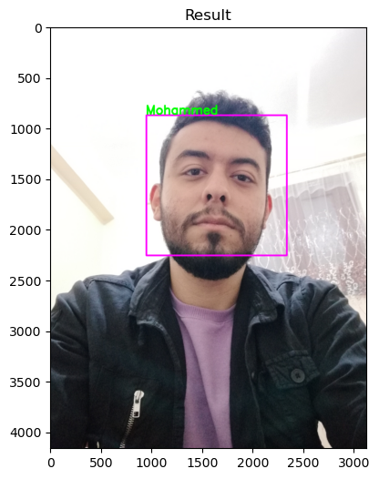

# One-Shot-Learning-Face-Recognation
This is a one shot learning face recognation project.

The project structure:
- Importing The Dependencies
- Required Functions
- Haarcascade Face Detector
- VGGFace Network
- Testing Stage
## Haarcascade Algorithm
The Haar Cascade algorithm is widely used for face detection in various applications, including security systems, video surveillance, and digital cameras. It is particularly well-suited for detecting frontal faces, but it can also be adapted for detecting other objects with similar features. I used it for detecting the 
frontal faces.
## VGGFace Network
VGGFace is a deep learning model that was trained to recognize faces in images and videos. It is based on the VGG-16 architecture and was pre-trained on a large-scale dataset of face images. The model has achieved state-of-the-art performance on several benchmarks for face recognition.
## Testing Result

